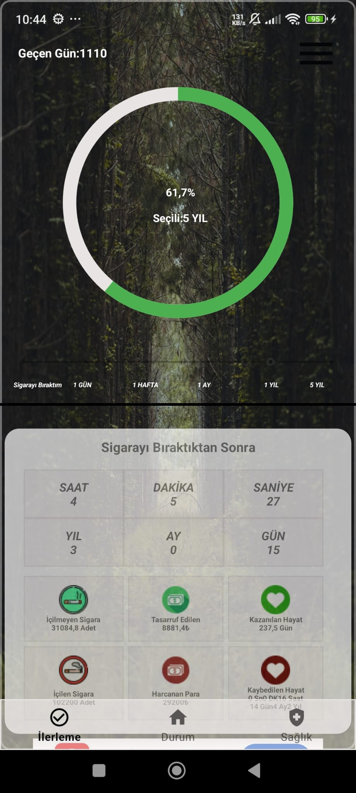
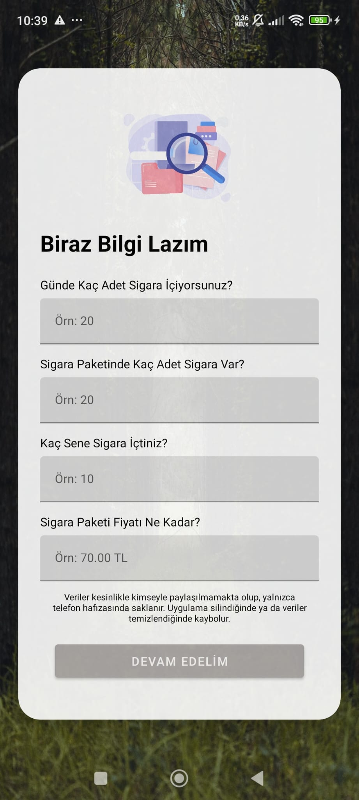
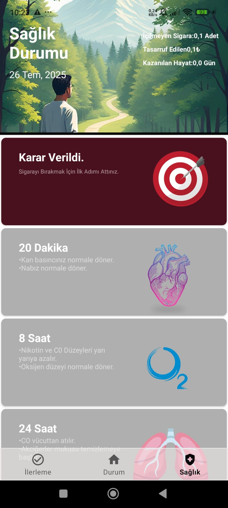
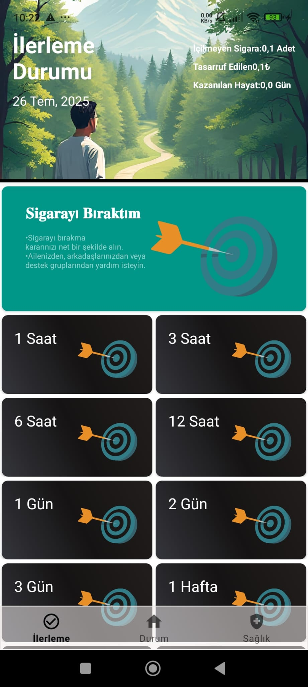

# 🚭 Sigara Bırakma Uygulaması

Bu Android uygulaması, sigarayı bırakmak isteyen kullanıcılara destek sağlamak amacıyla geliştirilmiştir. Uygulama basit ve kullanımı kolaydır, veriler cihaz hafızasında dosya tabanlı olarak saklanır.

---

## 🚀 Özellikler

- 📅 **Günlük Takip**  
  Sigara bırakma sürecindeki gün sayısı ve başarılar kaydedilir.

- 🗂️ **Veri Saklama**  
  Kullanıcı bilgileri ve uygulama verileri cihaz hafızasında basit dosya tabanlı olarak saklanır.

- 🔔 **Hatırlatıcılar**  
  Sigara bırakma hedeflerine yönelik kullanıcıya hatırlatmalar yapılabilir.

- 📱 **Basit ve Kullanıcı Dostu Arayüz**  
  Karmaşık olmayan, sade tasarım ile kolay kullanım.

---

## ⚙️ Kullanılan Teknolojiler

- Java & Android SDK  
- Dosya tabanlı veri saklama  
- Android Permissions  
- Modern UI tasarımı  

---

## 📸 Uygulama Ekran Görüntüleri

  
  
  
  
  
  

  
